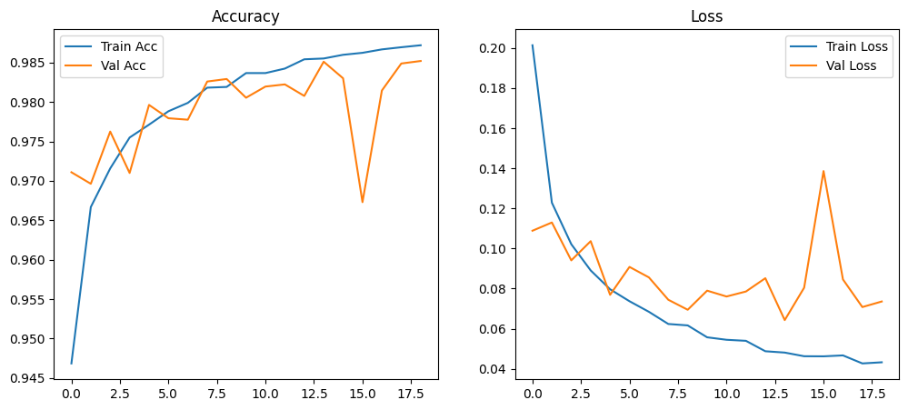

# 🫀 ECG Heartbeat Classification using Deep Learning

> **Project for:** Computer Science Bachelor's Application Portfolio  
> **Technologies:** Python, TensorFlow, Deep Learning, 1D CNN

##  Project Overview

This project classifies heartbeats into 5 different types using a 1D Convolutional Neural Network. It achieves **98.5% accuracy** on the MIT-BIH Arrhythmia dataset.

**Why I built this:**  
I'm passionate about applying AI to healthcare. This project shows my ability to:
- Work with real medical data
- Build deep learning models from scratch
- Write clean, documented code
- Solve classification problems

##  The Problem

Heart disease is a leading cause of death worldwide. Doctors spend hours analyzing ECG signals. Can AI help detect heart problems faster?

##  Dataset

- **Source:** MIT-BIH Arrhythmia Database (via Kaggle)
- **Samples:** 87,554 training | 21,892 testing
- **Signal length:** 187 time steps per heartbeat
- **Classes:** 5 types of heartbeats

| Class | Type | Description |
|-------|------|-------------|
| 0 | Normal | Regular heartbeat |
| 1 | Supraventricular | Upper chamber issue |
| 2 | Ventricular | Lower chamber issue |
| 3 | Fusion | Mixed beat pattern |
| 4 | Unknown | Unclassified beat |

##  Model Architecture
Input (187 time steps)
↓
Conv1D (64 filters, size 6) + BatchNorm + MaxPool
↓
Conv1D (64 filters, size 3) + BatchNorm + MaxPool
↓
Conv1D (64 filters, size 3) + BatchNorm + MaxPool
↓
Flatten + Dense(64) + Dropout(0.5)
↓
Output (5 classes)

**Total parameters:** 116,421 (small enough to run on Colab!)

##  Results

### Accuracy: **98.51%**

| Class | Precision | Recall | F1-Score |
|-------|-----------|--------|----------|
| Normal | 0.99 | 1.00 | 0.99 |
| Ventricular | 0.97 | 0.96 | 0.96 |
| Unknown | 0.99 | 0.99 | 0.99 |

### Training Progress

##  How to Run

### On Google Colab (Easiest)
1. Open [Google Colab](https://colab.research.google.com/)
2. Upload `ecg_classifier.ipynb`
3. Run all cells (Runtime → Run all)

### On Your Computer
bash
# Clone repository
git clone https://github.com/khaldazimi97-hub/ecg-heartbeat-classification
cd ecg-heartbeat-classification

# Install packages
pip install -r requirements.txt

# Run notebook
jupyter notebook ecg_classifier.ipynb

# What I Learned
CNNs work for 1D data too! (Not just images)

Batch normalization helps training stability

Class imbalance is real - Supraventricular beats are rare

Medical AI needs high accuracy - mistakes matter

# Future Improvements
Deploy as a web app using Flask/FastAPI

Add real-time ECG visualization

Test on other ECG datasets

Compare with other architectures (LSTM, Transformer)

# Skills Demonstrated
Python programming

TensorFlow/Keras

Data preprocessing

Model evaluation

Git/GitHub basics

Technical writing

# Acknowledgments
MIT-BIH for the arrhythmia database

Kaggle for hosting the dataset

TensorFlow team for the framework

# Contact
Khalid Azimi
🎓 Aspiring CS Student
📧 khaldazimi97@gmail.com

⭐ Star this repo if you find it useful!
